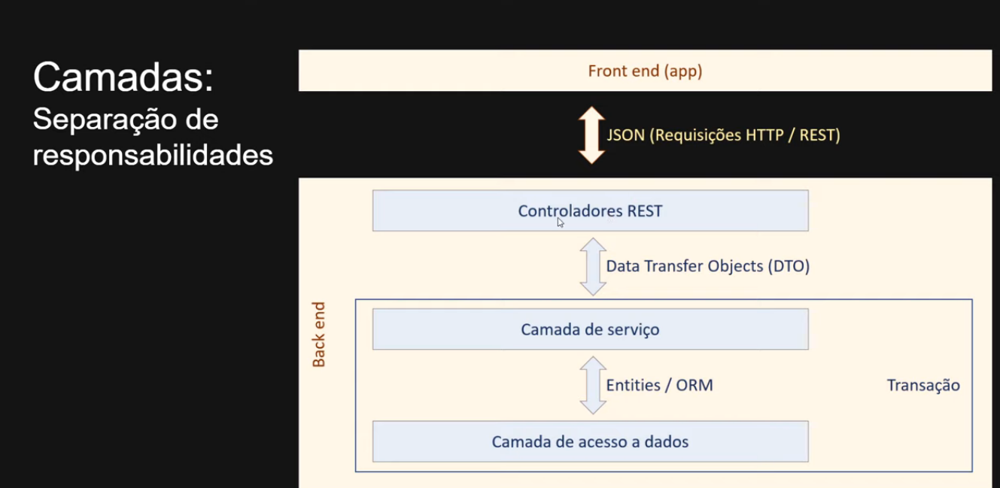
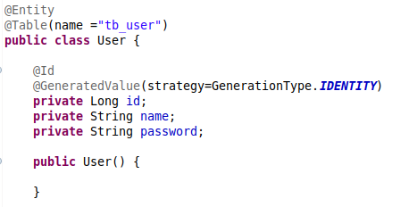

# Padrão de camadas com ORM & DTO

Este documento refere-se a um simples projeto de API desenvolvido em **spring** para treinar a habilidades de trabalhar com **DTO** utilizando padrão de camadas, sendo a camada mais em baixo de **repositórios**, a segunda camada de **serviços** e a terceira de **controller**, onde os objetos entre a camada de serviço e controlador são repassados por meio de um objeto DTO (Data Transfer Object) no qual tem o objetivo de repassar somente os dados que interessam na chamada da API.

## Design das camadas

## Técnologias empregadas

- Spring Boot
- Spring Data
- Spring Web

## Entidade User

Nessa entidade temos três atributos, ****************************id, nome & password,**************************** porém no consumo da API, retornaremos apenas o **********nome********** do usuários, pois o **password** não pode ser exposto e para isso utilizamos DTO.

 

## Entidade UserDTO

Para retornar só o atributo **nome** no consumo da API, foi criado dois atributos: **id** e **nome** e três contrutores, conforme abaixo:

1. O motivo pelo qual temos o primeiro construtor vazio, é que quando estamos trabalhando com framework spring, por padrão há a necessidade de ter o construtor default explicitado na classe;
2. O segundo construtor tem por objetivo instanciar um UserDTO;
3. Já o terceito construtor é o que de fato vai converter **User** em **UserDTO** para ser consumido na API.

## Classe UserService

Essa classe tem por objetivo converter uma entidade **User** em **UserDTO** e passar para o controlador o **UserDTO** contendo somente os dados necessários (**nome**) para o consumo da API. logo, criamos o método de procura por id para ser consumido na API.

**Obs**: É possível notar que o tipo de retorno desse método, é um UserDTO e por isso a conversão é feito dentro deste método

## Classe UserController

Essa classe tem por objetivo chamar o método do UserService que por sua vez configura toda a requisição para chamada da API

## Consumo da API

